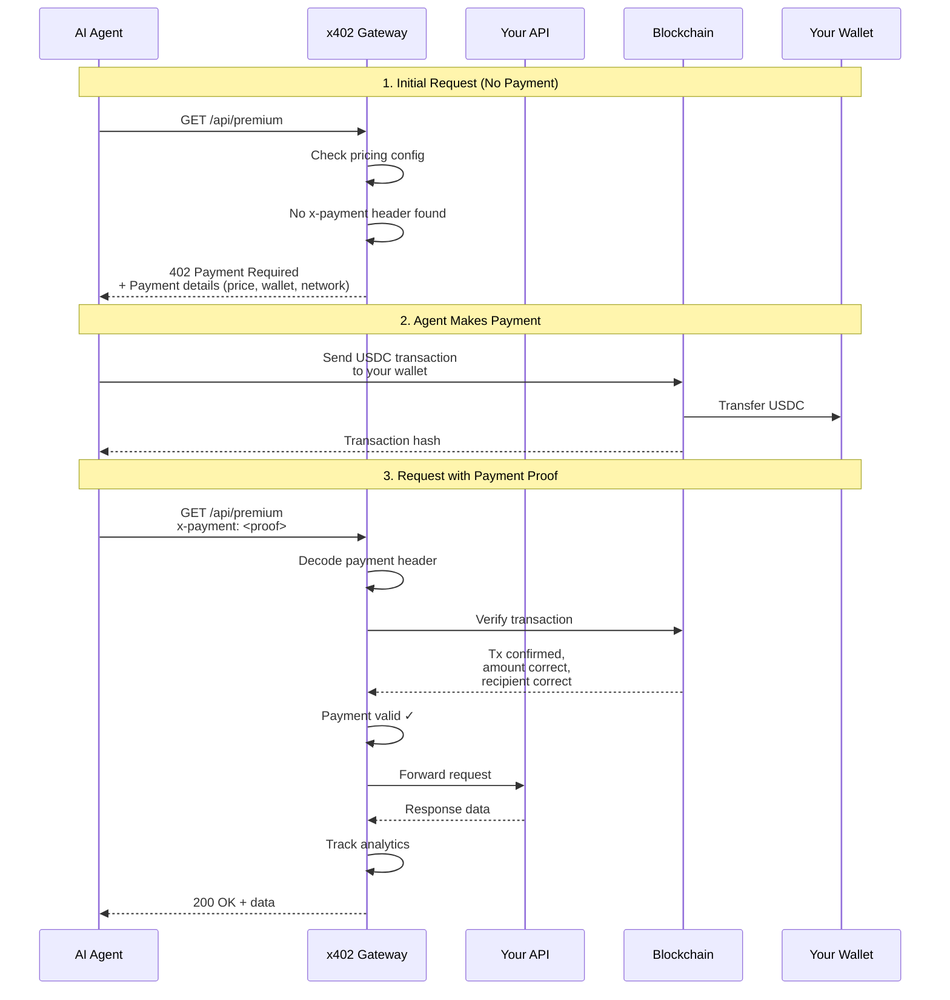

# x402-deploy Complete Guide

## What is x402-deploy?

**x402-deploy** is a complete toolkit for building and deploying AI-native APIs that accept cryptocurrency payments. It's the monetization layer of Universal Crypto MCP.

---

## Key Features

### 💰 Crypto Payment Gateway
- Accept **USDC, ETH, SOL** and other cryptocurrencies
- **On-chain verification** - payments verified directly on blockchain
- **Automatic settlements** - funds go directly to your wallet
- **No middleman** - non-custodial, you control your keys

### 🚀 One-Command Deployment
- Deploy to **Vercel, Railway, Fly.io** with one command
- **Docker & Docker Compose** support
- **Kubernetes** manifests included
- **CI/CD ready** - GitHub Actions, GitLab CI

### 🔍 AI Agent Discovery
- **Register your service** in the x402 discovery network
- **AI agents find you** automatically based on category, price, rating
- **Global marketplace** for AI services
- **Reputation system** built-in

### 📊 Built-in Analytics
- **Real-time dashboard** showing revenue, usage, top routes
- **Payment tracking** with transaction hashes
- **User analytics** - unique payers, repeat customers
- **Export capabilities** - CSV, JSON for further analysis

### 🛠️ Developer Friendly
- **Express middleware** - add to existing apps
- **MCP server wrapper** - monetize MCP tools
- **Next.js middleware** - Vercel-optimized
- **FastAPI decorator** - Python support

---

## Architecture

### System Overview

```
┌─────────────────────────────────────────────────────────┐
│                    AI Agent                              │
│  (Claude, ChatGPT, Custom Agent)                        │
└───────────────────┬─────────────────────────────────────┘
                    │
                    │ 1. Request API
                    ▼
┌─────────────────────────────────────────────────────────┐
│              x402 Gateway Middleware                     │
│  ┌─────────────────────────────────────────────────────┐│
│  │  1. Check Route Pricing                             ││
│  │  2. Verify Payment Header                           ││
│  │  3. Validate On-Chain (via viem)                    ││
│  │  4. Check Rate Limits                               ││
│  │  5. Track Analytics                                 ││
│  └─────────────────────────────────────────────────────┘│
└───────────────────┬─────────────────────────────────────┘
                    │
                    │ 2. If valid: Forward to API
                    │ If invalid: Return 402 + payment info
                    ▼
┌─────────────────────────────────────────────────────────┐
│                  Your API Logic                          │
│  ┌─────────────────────────────────────────────────────┐│
│  │  Express Routes / MCP Tools / Next.js API Routes   ││
│  │  Your business logic runs here                      ││
│  └─────────────────────────────────────────────────────┘│
└─────────────────────────────────────────────────────────┘

Parallel Process:
┌─────────────────────────────────────────────────────────┐
│              Blockchain Network                          │
│  ┌─────────────────────────────────────────────────────┐│
│  │  Payment sent by AI agent                           ││
│  │  Transaction mined on-chain                         ││
│  │  x402 gateway verifies transaction                  ││
│  │  Funds appear in your wallet                        ││
│  └─────────────────────────────────────────────────────┘│
└─────────────────────────────────────────────────────────┘
```

### Components

#### 1. Gateway Middleware
Entry point for all requests. Handles:
- Pricing lookup per route
- Payment verification
- Rate limiting
- Analytics tracking
- Error handling

**Location**: `x402-deploy/src/gateway/middleware.ts`

#### 2. Payment Verifier
Verifies payments on-chain using viem:
- Parses payment proof from header
- Queries blockchain for transaction
- Decodes ERC20 Transfer events
- Validates amount, recipient, token
- Returns verification result

**Location**: `x402-deploy/src/gateway/payment-verifier.ts`

#### 3. Pricing Engine
Dynamic pricing with multiple strategies:
- **Flat pricing**: Fixed price per route
- **Volume tiers**: Discounts for high-volume users
- **Load-based**: Price increases under high load
- **Time-based**: Peak/off-peak pricing

**Location**: `x402-deploy/src/gateway/pricing-engine.ts`

#### 4. Rate Limiter
Per-payer rate limiting:
- Token bucket algorithm
- Configurable limits per route
- Redis support for distributed systems
- Automatic quota resets

**Location**: `x402-deploy/src/gateway/rate-limiter.ts`

#### 5. Analytics Engine
Tracks all payment activity:
- Revenue by route
- Payment counts
- Unique payers
- Settlement status
- Historical trends

**Location**: `x402-deploy/src/gateway/analytics.ts`

#### 6. Discovery Protocol
Register and find services:
- Service registration in distributed network
- Search by category, price, rating
- Reputation scoring
- Service metadata (description, examples, docs)

**Location**: `x402-deploy/src/discovery/`

---

## Configuration

### Basic Configuration

Create `x402.config.json` in your project root:

```json
{
  "name": "my-api-service",
  "type": "express",
  "payment": {
    "wallet": "0xYourWalletAddress",
    "network": "eip155:42161",
    "token": "USDC",
    "facilitator": "https://facilitator.x402.dev"
  },
  "pricing": {
    "default": "$0.001",
    "routes": {
      "GET /api/free": "free",
      "GET /api/basic": "$0.001",
      "POST /api/premium": "$0.01",
      "GET /api/analytics/*": "$0.005"
    }
  },
  "discovery": {
    "enabled": true,
    "instructions": "This service provides weather forecasts and climate data analysis.",
    "categories": ["weather", "analytics"],
    "examples": [
      {
        "prompt": "Get weather forecast for New York",
        "response": "Temperature: 72°F, Conditions: Sunny"
      }
    ]
  }
}
```

### Configuration Options

#### Payment Configuration

| Field | Type | Required | Description |
|-------|------|----------|-------------|
| `wallet` | `0x${string}` | Yes | Your wallet address to receive payments |
| `network` | `Network` | Yes | Blockchain network (e.g., `eip155:42161` for Arbitrum) |
| `token` | `string` | No | Accepted token (default: `USDC`) |
| `facilitator` | `string` | No | x402 facilitator URL (default: official facilitator) |
| `acceptedAssets` | `string[]` | No | List of accepted tokens |

**Supported Networks**:
- `eip155:1` - Ethereum Mainnet
- `eip155:42161` - Arbitrum One
- `eip155:8453` - Base
- `eip155:137` - Polygon
- `eip155:10` - Optimism
- `eip155:84532` - Base Sepolia (testnet)

#### Pricing Configuration

| Field | Type | Description |
|-------|------|-------------|
| `default` | `string` | Default price for unpaid routes |
| `routes` | `object` | Route-specific pricing |

**Pricing Formats**:
- `"free"` - No payment required
- `"$0.001"` - Dollar amount (converted to USDC)
- `"0.001 USDC"` - Explicit token amount
- `"1000000"` - Wei/smallest unit amount

**Route Patterns**:
- Exact match: `"GET /api/data"`
- Wildcard: `"GET /api/data/*"`
- Method wildcard: `"* /api/data"`
- Path wildcard: `"GET /api/**"`

#### Discovery Configuration

| Field | Type | Description |
|-------|------|-------------|
| `enabled` | `boolean` | Enable service discovery |
| `instructions` | `string` | How AI agents should use your service |
| `categories` | `string[]` | Service categories for discoverability |
| `examples` | `array` | Example prompts and responses |
| `metadata` | `object` | Additional metadata |

**Example Categories**:
- `weather`, `finance`, `analytics`, `data`, `ai`, `blockchain`, `defi`, `nft`, `gaming`, `social`

#### Rate Limiting

```json
{
  "rateLimit": {
    "enabled": true,
    "maxRequests": 100,
    "windowSeconds": 3600,
    "perPayer": true,
    "redisUrl": "redis://localhost:6379"
  }
}
```

#### Analytics

```json
{
  "analytics": {
    "enabled": true,
    "webhookUrl": "https://your-domain.com/webhooks/payment",
    "webhookSecret": "your-webhook-secret",
    "verbose": false
  }
}
```

---

## Quick Start Guide

### 1. Install x402-deploy

```bash
npm install @nirholas/universal-crypto-mcp
```

### 2. Create Configuration

```bash
npx x402-deploy init
```

This creates an interactive wizard that generates `x402.config.json`.

### 3. Wrap Your API

#### Express Example

```typescript
import express from 'express';
import { wrapWithX402 } from '@nirholas/universal-crypto-mcp/x402';
import config from './x402.config.json';

const app = express();

// Your existing routes
app.get('/api/data', (req, res) => {
  res.json({ data: 'premium content' });
});

// Wrap with x402
const wrappedApp = wrapWithX402(app, config);

wrappedApp.listen(3000, () => {
  console.log('Server running with x402 payments on port 3000');
});
```

#### MCP Server Example

```typescript
import { createX402McpServer } from '@nirholas/universal-crypto-mcp/x402';
import config from './x402.config.json';

const server = createX402McpServer({
  config,
  tools: {
    analyze_sentiment: {
      description: 'Analyze crypto sentiment from social media',
      inputSchema: {
        type: 'object',
        properties: {
          symbol: { type: 'string' }
        }
      },
      handler: async ({ symbol }) => {
        const sentiment = await analyzeSentiment(symbol);
        return { sentiment, confidence: 0.85 };
      }
    }
  }
});

server.listen();
```

#### Next.js Example

```typescript
// middleware.ts
import { createX402Middleware } from '@nirholas/universal-crypto-mcp/x402/next';
import config from './x402.config.json';

export const middleware = createX402Middleware(config);

export const config = {
  matcher: '/api/:path*'
};
```

### 4. Test Locally

```bash
# Start your server
npm start

# In another terminal, test the payment flow
curl -X GET http://localhost:3000/api/data
# Returns: 402 Payment Required + payment instructions

# Make payment (simulated)
curl -X GET http://localhost:3000/api/data \
  -H "x-payment: <base64-encoded-payment-proof>"
# Returns: 200 OK + data
```

### 5. Deploy

```bash
# Deploy to Vercel
npx x402-deploy deploy --provider vercel

# Deploy to Railway
npx x402-deploy deploy --provider railway

# Deploy to Fly.io
npx x402-deploy deploy --provider fly

# Or use Docker
docker build -t my-paid-api .
docker run -p 3000:3000 my-paid-api
```

---

## Payment Flow

### Step-by-Step Process



### Payment Verification Process

The gateway verifies payments through these steps:

1. **Parse Payment Header**
   ```typescript
   const payment = JSON.parse(
     Buffer.from(req.headers['x-payment'], 'base64').toString()
   );
   ```

2. **Query Blockchain**
   ```typescript
   const tx = await publicClient.getTransactionReceipt({
     hash: payment.txHash
   });
   ```

3. **Decode Transfer Event**
   ```typescript
   const transferEvent = decodeEventLog({
     abi: parseAbi(['event Transfer(address indexed from, address indexed to, uint256 value)']),
     data: log.data,
     topics: log.topics
   });
   ```

4. **Validate Amount**
   ```typescript
   const expectedAmount = parseUnits(price, decimals);
   const actualAmount = transferEvent.args.value;
   
   if (actualAmount < expectedAmount) {
     return { valid: false, error: 'Insufficient payment' };
   }
   ```

5. **Validate Recipient**
   ```typescript
   if (transferEvent.args.to.toLowerCase() !== wallet.toLowerCase()) {
     return { valid: false, error: 'Wrong recipient' };
   }
   ```

---

## Deployment Guides

### Vercel Deployment

**Prerequisites**:
- Vercel account
- Vercel CLI installed (`npm i -g vercel`)
- VERCEL_TOKEN environment variable

**Steps**:

1. **Initialize Vercel**
   ```bash
   vercel login
   ```

2. **Deploy with x402**
   ```bash
   npx x402-deploy deploy --provider vercel
   ```

   This:
   - Creates `vercel.json` configuration
   - Generates Next.js middleware for payments
   - Sets environment variables
   - Deploys to Vercel
   - Returns deployment URL

3. **Configure Environment**
   ```bash
   # Set in Vercel dashboard or CLI
   vercel env add X402_WALLET_ADDRESS production
   vercel env add X402_NETWORK production
   ```

4. **Test Deployment**
   ```bash
   curl https://your-app.vercel.app/api/test
   ```

### Railway Deployment

**Prerequisites**:
- Railway account
- Railway CLI installed (`npm i -g @railway/cli`)
- RAILWAY_TOKEN environment variable

**Steps**:

1. **Login to Railway**
   ```bash
   railway login
   ```

2. **Deploy**
   ```bash
   npx x402-deploy deploy --provider railway
   ```

   This:
   - Creates Railway project
   - Configures environment variables
   - Generates `railway.toml`
   - Deploys your service
   - Provisions domain

3. **View Logs**
   ```bash
   railway logs
   ```

### Docker Deployment

**Generated Files**:
- `Dockerfile` - Optimized Node.js container
- `docker-compose.yml` - Multi-service setup with Redis
- `.dockerignore` - Exclude unnecessary files

**Deploy Locally**:

```bash
# Build image
docker build -t my-paid-api .

# Run container
docker run -d \
  -p 3000:3000 \
  -e WALLET_ADDRESS=0x... \
  -e NETWORK=eip155:42161 \
  --name my-api \
  my-paid-api

# View logs
docker logs -f my-api
```

**Deploy with Docker Compose**:

```bash
# Start all services
docker-compose up -d

# Includes:
# - Your API server
# - Redis (for rate limiting)
# - Prometheus (monitoring)

# Check status
docker-compose ps

# View logs
docker-compose logs -f api
```

### Kubernetes Deployment

**Generated Files**:
- `k8s/deployment.yaml` - Deployment configuration
- `k8s/service.yaml` - Service definition
- `k8s/ingress.yaml` - Ingress rules
- `k8s/configmap.yaml` - Configuration
- `k8s/secret.yaml` - Sensitive data

**Deploy to K8s**:

```bash
# Create namespace
kubectl create namespace x402-apis

# Apply configurations
kubectl apply -f k8s/ -n x402-apis

# Check deployment
kubectl get pods -n x402-apis
kubectl get svc -n x402-apis

# View logs
kubectl logs -f deployment/my-api -n x402-apis
```

---

## Analytics & Monitoring

### Built-in Dashboard

Access the analytics dashboard:

```bash
# CLI dashboard
npx x402-deploy dashboard

# Or start web dashboard
npx x402-deploy dashboard --web --port 8080
```

**Dashboard Features**:
- **Revenue**: Total, by period, by route
- **Payments**: Count, average value, settlement status
- **Users**: Unique payers, top customers, repeat rate
- **Routes**: Most used, most profitable, pricing optimization
- **Trends**: Daily/weekly/monthly charts

### Metrics Endpoint

Enable Prometheus metrics:

```typescript
import { createMetricsEndpoint } from '@nirholas/universal-crypto-mcp/x402';

app.use('/metrics', createMetricsEndpoint());
```

**Available Metrics**:
- `x402_requests_total` - Total API requests
- `x402_payments_total` - Total payments received
- `x402_revenue_total` - Total revenue (in USD)
- `x402_payment_verification_duration` - Verification time
- `x402_route_requests` - Requests per route
- `x402_unique_payers` - Unique payer addresses

### Webhooks

Receive real-time payment notifications:

```json
{
  "analytics": {
    "webhookUrl": "https://your-domain.com/webhooks/payment",
    "webhookSecret": "your-secret-key"
  }
}
```

**Webhook Payload**:

```json
{
  "event": "payment.received",
  "timestamp": "2026-01-29T12:00:00Z",
  "data": {
    "paymentId": "pay_abc123",
    "payer": "0x742d35Cc6634C0532925a3b844Bc9e7595f0bEb",
    "amount": "1000000",
    "asset": "USDC",
    "route": "GET /api/premium",
    "txHash": "0x..."
  },
  "signature": "sha256-hmac-signature"
}
```

**Verify Webhook**:

```typescript
import crypto from 'crypto';

function verifyWebhook(payload, signature, secret) {
  const hmac = crypto
    .createHmac('sha256', secret)
    .update(JSON.stringify(payload))
    .digest('hex');
  
  return `sha256=${hmac}` === signature;
}
```

---

## Advanced Features

### Dynamic Pricing

Configure volume-based pricing tiers:

```typescript
import { PricingEngine } from '@nirholas/universal-crypto-mcp/x402';

const engine = new PricingEngine({
  'GET /api/data': '$0.01'
});

// Set dynamic pricing
engine.setDynamicPricing('GET /api/data', {
  basePrice: '$0.01',
  tiers: [
    { minRequests: 0, maxRequests: 100, price: '$0.01' },
    { minRequests: 100, maxRequests: 1000, price: '$0.008' },
    { minRequests: 1000, price: '$0.005' }
  ],
  loadMultiplier: 1.5 // Increase price 1.5x under high load
});

// Calculate price for a user
const price = engine.calculatePrice('GET /api/data', '0x742d...');
```

### Custom Verification

Implement custom payment verification logic:

```typescript
import { createX402Gateway } from '@nirholas/universal-crypto-mcp/x402';

const gateway = createX402Gateway({
  config,
  customVerifier: async (payment, expectedPrice, expectedWallet) => {
    // Your custom verification logic
    const isValid = await myCustomVerification(payment);
    
    return {
      valid: isValid,
      payer: payment.from,
      amount: payment.amount,
      txHash: payment.txHash
    };
  }
});
```

### Escrow Payments

Enable escrow for high-value transactions:

```typescript
{
  "payment": {
    "wallet": "0x...",
    "escrow": {
      "enabled": true,
      "minAmount": "$10",
      "releaseDelay": 3600 // 1 hour
    }
  }
}
```

### Multi-Asset Support

Accept multiple cryptocurrencies:

```typescript
{
  "payment": {
    "wallet": "0x...",
    "acceptedAssets": [
      { "symbol": "USDC", "address": "0xA0b86991c6218b36c1d19D4a2e9Eb0cE3606eB48" },
      { "symbol": "USDT", "address": "0xdAC17F958D2ee523a2206206994597C13D831ec7" },
      { "symbol": "DAI", "address": "0x6B175474E89094C44Da98b954EedeAC495271d0F" }
    ]
  }
}
```

---

## CLI Reference

### Commands

**`init`** - Initialize x402 configuration
```bash
npx x402-deploy init [options]
  --force            Overwrite existing config
  --template <name>  Use template (express, next, mcp)
```

**`deploy`** - Deploy to production
```bash
npx x402-deploy deploy [options]
  --provider <name>  Deployment provider (vercel, railway, fly, docker)
  --env <env>        Environment name (production, staging)
```

**`dashboard`** - View analytics
```bash
npx x402-deploy dashboard [options]
  --web             Start web dashboard
  --port <port>     Dashboard port (default: 8080)
  --format <fmt>    Output format (table, json, csv)
```

**`test`** - Test payment flow locally
```bash
npx x402-deploy test [options]
  --route <path>    Route to test
  --simulate        Simulate payment
```

**`marketplace`** - Manage service listings
```bash
npx x402-deploy marketplace <command>
  register          Register service in discovery network
  update            Update service metadata
  unregister        Remove service listing
  search            Search for services
```

**`analytics`** - Export analytics data
```bash
npx x402-deploy analytics [options]
  --export <file>   Export to file
  --format <fmt>    Format (json, csv)
  --period <days>   Time period (default: 30)
```

---

## Troubleshooting

### Payment Not Verified

**Symptoms**: Requests return 402 even after payment

**Solutions**:
1. Check transaction confirmed on blockchain
2. Verify correct network in config
3. Ensure payment amount matches price
4. Confirm wallet address is correct
5. Check transaction went to correct recipient

```bash
# Debug payment verification
DEBUG=x402:payment npx x402-deploy test --route /api/premium
```

### Rate Limit Errors

**Symptoms**: 429 Too Many Requests

**Solutions**:
1. Increase rate limit in config
2. Use Redis for distributed rate limiting
3. Implement per-payer limits
4. Check for request loops

```json
{
  "rateLimit": {
    "enabled": true,
    "maxRequests": 1000,
    "windowSeconds": 3600
  }
}
```

### Deployment Failures

**Symptoms**: Deployment fails or times out

**Solutions**:
1. Check API keys (VERCEL_TOKEN, RAILWAY_TOKEN)
2. Verify account limits not exceeded
3. Check build logs for errors
4. Ensure dependencies installed

```bash
# View detailed logs
npx x402-deploy deploy --provider vercel --verbose
```

### Discovery Not Working

**Symptoms**: Service not appearing in searches

**Solutions**:
1. Verify `discovery.enabled` is `true`
2. Check categories are valid
3. Confirm service metadata is complete
4. Wait for network propagation (up to 5 minutes)

```bash
# Verify registration
npx x402-deploy marketplace search --query "your-service-name"
```

---

## Best Practices

### Security

1. **Never commit private keys**
   ```bash
   # Use environment variables
   export X402_WALLET_PRIVATE_KEY="0x..."
   
   # Or .env files (add to .gitignore)
   echo "X402_WALLET_PRIVATE_KEY=0x..." > .env
   ```

2. **Use separate wallets**
   - Development wallet (testnet, minimal funds)
   - Production wallet (mainnet, protected)

3. **Validate all inputs**
   ```typescript
   app.get('/api/data', validateInput, (req, res) => {
     // Your logic
   });
   ```

4. **Rate limiting**
   ```typescript
   {
     "rateLimit": {
       "enabled": true,
       "maxRequests": 100,
       "windowSeconds": 3600,
       "perPayer": true
     }
   }
   ```

### Pricing Strategy

1. **Start low**: Begin with low prices to attract users
2. **Volume discounts**: Reward frequent users with tiers
3. **Monitor usage**: Adjust prices based on demand
4. **Test pricing**: A/B test different price points

### Performance

1. **Cache aggressively**
   ```typescript
   import NodeCache from 'node-cache';
   const cache = new NodeCache({ stdTTL: 600 });
   
   app.get('/api/data', async (req, res) => {
     const cached = cache.get('data');
     if (cached) return res.json(cached);
     
     const data = await expensiveOperation();
     cache.set('data', data);
     res.json(data);
   });
   ```

2. **Use Redis for scaling**
   ```json
   {
     "rateLimit": {
       "redisUrl": "redis://localhost:6379"
     }
   }
   ```

3. **Optimize payment verification**
   ```typescript
   {
     "payment": {
       "verificationCache": true,
       "cacheTTL": 300
     }
   }
   ```

### Monitoring

1. **Enable analytics**
2. **Set up webhooks** for critical events
3. **Monitor error rates**
4. **Track revenue metrics**

---

## Examples

### Example 1: Weather API

```typescript
import express from 'express';
import { wrapWithX402 } from '@nirholas/universal-crypto-mcp/x402';

const app = express();

app.get('/api/weather/:city', async (req, res) => {
  const weather = await getWeatherData(req.params.city);
  res.json(weather);
});

wrapWithX402(app, {
  payment: {
    wallet: '0x...',
    network: 'eip155:42161'
  },
  pricing: {
    routes: {
      'GET /api/weather/*': '$0.001'
    }
  },
  discovery: {
    enabled: true,
    instructions: 'Get current weather and forecasts for any city worldwide.',
    categories: ['weather', 'data']
  }
});

app.listen(3000);
```

### Example 2: AI Sentiment Analysis

```typescript
import { createX402McpServer } from '@nirholas/universal-crypto-mcp/x402';

const server = createX402McpServer({
  payment: {
    wallet: '0x...',
    network: 'eip155:8453' // Base
  },
  pricing: {
    tools: {
      'analyze_sentiment': '$0.01',
      'batch_analyze': '$0.05'
    }
  },
  tools: {
    analyze_sentiment: {
      description: 'Analyze sentiment of crypto social media',
      inputSchema: {
        type: 'object',
        properties: {
          symbol: { type: 'string', description: 'Crypto symbol (BTC, ETH, etc.)' },
          sources: { type: 'array', items: { type: 'string' } }
        },
        required: ['symbol']
      },
      handler: async ({ symbol, sources }) => {
        const sentiment = await analyzeCryptoSentiment(symbol, sources);
        return {
          symbol,
          sentiment: sentiment.score,
          confidence: sentiment.confidence,
          summary: sentiment.summary
        };
      }
    }
  }
});

server.listen();
```

### Example 3: Data Analytics API

```typescript
import express from 'express';
import { wrapWithX402, PricingEngine } from '@nirholas/universal-crypto-mcp/x402';

const app = express();
const engine = new PricingEngine({
  'POST /api/analyze': '$0.01'
});

// Volume-based pricing
engine.setDynamicPricing('POST /api/analyze', {
  basePrice: '$0.01',
  tiers: [
    { minRequests: 0, maxRequests: 100, price: '$0.01' },
    { minRequests: 100, maxRequests: 1000, price: '$0.008' },
    { minRequests: 1000, price: '$0.005' }
  ]
});

app.post('/api/analyze', async (req, res) => {
  const results = await analyzeData(req.body);
  res.json(results);
});

wrapWithX402(app, {
  payment: { wallet: '0x...', network: 'eip155:137' },
  pricingEngine: engine,
  analytics: {
    enabled: true,
    webhookUrl: 'https://myapp.com/webhooks/payment'
  }
});

app.listen(3000);
```

---

## API Reference

Full API documentation: [API Reference →](./api-reference.md)

---

## Further Reading

- **[Getting Started](../getting-started/quickstart.md)** - Set up your first paid API
- **[Discovery Protocol](./discovery.md)** - How AI agents find services
- **[Deployment Guide](./deployment.md)** - Production deployment strategies
- **[Security Best Practices](./security.md)** - Secure your paid APIs
- **[Scaling Guide](./scaling.md)** - Handle high traffic

---

<div align="center">

**Ready to monetize your AI services?**

[Get Started →](./quick-start.md)

</div>
