<div align="center">  

```

                                                                                      
    ██████╗ ███╗   ██╗██████╗      ██████╗██╗  ██╗ █████╗ ██╗███╗   ██╗              
    ██╔══██╗████╗  ██║██╔══██╗    ██╔════╝██║  ██║██╔══██╗██║████╗  ██║              
    ██████╔╝██╔██╗ ██║██████╔╝    ██║     ███████║███████║██║██╔██╗ ██║              
    ██╔══██╗██║╚██╗██║██╔══██╗    ██║     ██╔══██║██╔══██║██║██║╚██╗██║              
    ██████╔╝██║ ╚████║██████╔╝    ╚██████╗██║  ██║██║  ██║██║██║ ╚████║              
    ╚═════╝ ╚═╝  ╚═══╝╚═════╝      ╚═════╝╚═╝  ╚═╝╚═╝  ╚═╝╚═╝╚═╝  ╚═══╝              
                                                                                      
              ███╗   ███╗ ██████╗██████╗     ███████╗███████╗██████╗ ██╗   ██╗███████╗██████╗  
              ████╗ ████║██╔════╝██╔══██╗    ██╔════╝██╔════╝██╔══██╗██║   ██║██╔════╝██╔══██╗ 
              ██╔████╔██║██║     ██████╔╝    ███████╗█████╗  ██████╔╝██║   ██║█████╗  ██████╔╝ 
              ██║╚██╔╝██║██║     ██╔═══╝     ╚════██║██╔══╝  ██╔══██╗╚██╗ ██╔╝██╔══╝  ██╔══██╗ 
              ██║ ╚═╝ ██║╚██████╗██║         ███████║███████╗██║  ██║ ╚████╔╝ ███████╗██║  ██║ 
              ╚═╝     ╚═╝ ╚═════╝╚═╝         ╚══════╝╚══════╝╚═╝  ╚═╝  ╚═══╝  ╚══════╝╚═╝  ╚═╝ 
                                                                                      

```

<h1>BNB Chain MCP Server</h1>

<p><strong>The most comprehensive Model Context Protocol server for BNB Chain & EVM blockchains</strong></p>

<p>Enable AI agents to interact with BNB Chain, opBNB, and other EVM networks through natural language</p>

[](https://opensource.org/licenses/MIT)
[](https://modelcontextprotocol.io)
[](https://www.typescriptlang.org/)
[](https://www.bnbchain.org)

<br/>

[](https://www.bnbchain.org)
[](https://opbnb.bnbchain.org)


<br/>

<!-- Animated Demo -->


<br/><br/>

> ⭐ **If you find this useful, please star the repo!** It helps others discover this project.

<br/>

[📖 Documentation](https://bnb-chain-mcp.vercel.app) • [🚀 Quick Start](#-quick-start) • [🛠️ Features](#-features-overview) • [📊 Roadmap](#️-roadmap) • [🤝 Contributing](#-contributing)

</div>

---

## 📋 Table of Contents

- [What is BNB Chain MCP?](#-what-is-bnb-chain-mcp)
- [Quick Start](#-quick-start)
- [Features Overview](#-features-overview)
- [Supported Networks](#-supported-networks)
- [Installation](#-installation)
- [Configuration](#-configuration)
- [Data Sources](#-data-sources)
- [Example Conversations](#-example-conversations)
- [Architecture](#-architecture)
- [Roadmap](#️-roadmap)
- [Related MCP Servers](#-related-mcp-servers)
- [Troubleshooting](#-troubleshooting)
- [Contributing](#-contributing)
- [License](#-license)

---

## 🌟 What is BNB Chain MCP?

**BNB Chain MCP** is a Model Context Protocol (MCP) server optimized for BNB Chain and opBNB, while also supporting other EVM-compatible blockchains. It enables AI assistants like Claude, ChatGPT, and Cursor to interact with blockchain networks through natural language.

### Why BNB Chain MCP?

```
┌──────────────────────────────────────────────────────────────────────────────┐
│                                                                              │
│   User: "What's the current price of ETH and show me the best DEX pools"     │
│                                    │                                         │
│                                    ▼                                         │
│   ┌────────────────────────────────────────────────────────┐                 │
│   │              AI Assistant (Claude/ChatGPT)             │                 │
│   │                                                        │                 │
│   │         "Let me check that for you..."                 │                 │
│   └────────────────────────────────────────────────────────┘                 │
│                                    │                                         │
│                                    ▼                                         │
│   ┌───────────────────────────────────────────────────────┐                  │
│   │                  BNB Chain MCP Server                 │                  │
│   │                                                       │                  │
│   │   ┌──────────┐  ┌──────────┐  ┌──────────┐            │                  │
│   │   │CoinGecko │  │GeckoTerm │  │DefiLlama │   ...      │                  │
│   │   └────┬─────┘  └────┬─────┘  └────┬─────┘            │                  │
│   └────────┼─────────────┼─────────────┼──────────────────┘                  │
│            │             │             │                                     │
│            ▼             ▼             ▼                                     │
│   ┌────────────────────────────────────────────────────────┐                 │
│   │                  Blockchain Networks                   │                 │
│   │   BNB Chain  │  Ethereum  │  Arbitrum  │  Polygon      │                 │
│   └────────────────────────────────────────────────────────┘                 │
│                                                                              │
└──────────────────────────────────────────────────────────────────────────────┘
```

### Key Benefits

| Benefit | Description |
|---------|-------------|
| **Natural Language** | Ask questions in plain English, get blockchain data instantly |
| **Multi-Chain** | One server supports 10+ EVM networks simultaneously |
| **Read + Write** | Query data or execute transactions (with wallet) |
| **Security Built-In** | GoPlus integration for token/contract safety checks |
| **Rich Data** | Prices, DEX pools, TVL, social sentiment, news & more |
| **AI-Native** | Built specifically for LLMs with structured responses |

### Use Cases

<details>
<summary><strong>🔍 Research & Analysis</strong></summary>

- Check token prices and historical data
- Analyze DEX liquidity pools
- Monitor protocol TVL and metrics
- Research new tokens before investing
- Track whale wallets and movements

</details>

<details>
<summary><strong>💹 Trading & DeFi</strong></summary>

- Get swap quotes across DEX aggregators
- Find best yield farming opportunities
- Monitor lending rates on Aave/Compound
- Execute token swaps and transfers
- Bridge tokens across chains

</details>

<details>
<summary><strong>🛡️ Security & Compliance</strong></summary>

- Detect honeypot tokens
- Check for rug pull risks
- Verify smart contract safety
- Screen wallet addresses
- Check token holder distribution

</details>

<details>
<summary><strong>👨‍💻 Development</strong></summary>

- Deploy and verify smart contracts
- Query contract state and events
- Test transactions before execution
- Manage multi-sig operations
- Debug failed transactions

</details>

<br/>

<div align="center">
  
  <p><em>DeFi tools in action: swap quotes, TVL tracking, and more</em></p>
</div>

---

## 🚀 Quick Start

Get up and running in under 60 seconds!

### Option 1: Claude Desktop (Recommended)

Add to your `claude_desktop_config.json`:

```json
{
  "mcpServers": {
    "bnb-chain-mcp": {
      "command": "npx",
      "args": ["-y", "@nirholas/bnb-chain-mcp@latest"]
    }
  }
}
```

<details>
<summary>📁 Config file locations</summary>

| OS | Path |
|----|------|
| **macOS** | `~/Library/Application Support/Claude/claude_desktop_config.json` |
| **Windows** | `%APPDATA%\Claude\claude_desktop_config.json` |
| **Linux** | `~/.config/claude/claude_desktop_config.json` |

</details>

### Option 2: Cursor / VS Code

Add to your MCP settings:

```json
{
  "mcpServers": {
    "bnb-chain-mcp": {
      "command": "npx",
      "args": ["-y", "@nirholas/bnb-chain-mcp@latest"]
    }
  }
}
```

### Option 3: ChatGPT Developer Mode

1. Enable [Developer Mode](https://chatgpt.com/#settings/Connectors/Advanced) in ChatGPT settings
2. Start the HTTP server:
   ```bash
   npx @nirholas/bnb-chain-mcp@latest --http
   ```
3. In ChatGPT Settings → Apps, click **Create app**
4. Enter your server URL: `http://localhost:3001/mcp`
5. Select the app in conversations via **Developer mode** menu

📖 [Full ChatGPT Setup Guide](https://bnb-chain-mcp.vercel.app/mcp-server/chatgpt-setup/)

### Option 4: npx Instant Start

```bash
# stdio mode (Claude, Cursor)
npx @nirholas/bnb-chain-mcp@latest

# HTTP mode (ChatGPT Developer Mode)
npx @nirholas/bnb-chain-mcp@latest --http

# SSE mode (legacy clients)
npx @nirholas/bnb-chain-mcp@latest --sse
```

---

## 🛠️ Features Overview

### Feature Matrix

| Category | Features | Status |
|----------|----------|--------|
| **Swap/DEX** | Token swaps via 1inch, 0x, ParaSwap | ✅ |
| **Bridge** | Cross-chain transfers via LayerZero, Stargate | ✅ |
| **Gas** | Gas prices across chains, EIP-1559 suggestions | ✅ |
| **Multicall** | Batch read/write operations | ✅ |
| **Events/Logs** | Query historical events, decode logs | ✅ |
| **Security** | Rug pull detection, honeypot check, GoPlus integration | ✅ |
| **Staking** | Liquid staking (Lido), LP farming | ✅ |
| **Signatures** | Sign messages, verify signatures, EIP-712 | ✅ |
| **Lending** | Aave/Compound positions, borrow rates | ✅ |
| **Price Feeds** | Historical prices, TWAP, oracle aggregation | ✅ |
| **Portfolio** | Track holdings across chains | ✅ |
| **Governance** | Snapshot votes, on-chain proposals | ✅ |
| **Deployment** | Deploy contracts, CREATE2, upgradeable proxies | ✅ |
| **MEV Protection** | Flashbots Protect, private transactions | ✅ |
| **ENS/Domains** | Register, transfer, renew, set records | ✅ |
| **Market Data** | CoinGecko prices, OHLCV, trending | ✅ |
| **DeFi Analytics** | DefiLlama TVL, yields, fees, protocols | ✅ |
| **Social Sentiment** | LunarCrush metrics, influencers, trending | ✅ |
| **DEX Analytics** | GeckoTerminal pools, trades, OHLCV | ✅ |

### Tool Categories

<details>
<summary><strong>🔗 Core Blockchain (45+ tools)</strong></summary>

| Tool | Description |
|------|-------------|
| `get_chain_info` | Get chain ID, block number, gas price |
| `get_block` | Get block by number or hash |
| `get_transaction` | Get transaction details and receipt |
| `send_transaction` | Send native token transfer |
| `estimate_gas` | Estimate gas for transaction |
| `get_balance` | Get native/token balance |
| `call_contract` | Call view/pure contract functions |
| ... | [See full list →](https://bnb-chain-mcp.vercel.app/tools/blockchain) |

</details>

<details>
<summary><strong>💰 Token Operations (30+ tools)</strong></summary>

| Tool | Description |
|------|-------------|
| `get_token_info` | Get name, symbol, decimals, supply |
| `get_token_balance` | Get token balance for address |
| `transfer_token` | Transfer ERC-20 tokens |
| `approve_token` | Approve spending allowance |
| `get_nft_metadata` | Get NFT metadata and traits |
| `transfer_nft` | Transfer ERC-721 NFT |
| ... | [See full list →](https://bnb-chain-mcp.vercel.app/tools/tokens) |

</details>

<details>
<summary><strong>🏦 DeFi (50+ tools)</strong></summary>

| Tool | Description |
|------|-------------|
| `get_swap_quote` | Get swap quote from DEX aggregators |
| `execute_swap` | Execute token swap |
| `add_liquidity` | Add liquidity to DEX pools |
| `get_lending_rates` | Get Aave/Compound rates |
| `supply_to_lending` | Supply assets to lending protocol |
| `get_farming_apy` | Get yield farming APY |
| ... | [See full list →](https://bnb-chain-mcp.vercel.app/tools/defi) |

</details>

<details>
<summary><strong>🔒 Security (15+ tools)</strong></summary>

| Tool | Description |
|------|-------------|
| `check_token_security` | GoPlus token security analysis |
| `detect_honeypot` | Check if token is honeypot |
| `check_rug_pull` | Assess rug pull risk |
| `get_holder_distribution` | Get top holder breakdown |
| `check_contract_verified` | Verify contract source |
| `screen_address` | Check address risk score |
| ... | [See full list →](https://bnb-chain-mcp.vercel.app/tools/security) |

</details>

<details>
<summary><strong>📊 Market Data (25+ tools)</strong></summary>

| Tool | Description |
|------|-------------|
| `get_price` | Get current token price |
| `get_price_history` | Get historical OHLCV data |
| `get_trending_coins` | Get trending tokens |
| `get_tvl` | Get protocol TVL from DefiLlama |
| `get_dex_pools` | Get DEX pool data |
| `get_social_metrics` | Get LunarCrush sentiment |
| ... | [See full list →](https://bnb-chain-mcp.vercel.app/tools/market-data) |

</details>

---

## 🌐 Supported Networks

| Network | Chain ID | Native Token | Status |
|---------|----------|--------------|--------|
| **BNB Smart Chain** | 56 | BNB | ✅ Full Support |
| **opBNB** | 204 | BNB | ✅ Full Support |
| **Arbitrum One** | 42161 | ETH | ✅ Full Support |
| **Ethereum** | 1 | ETH | ✅ Full Support |
| **Polygon** | 137 | MATIC | ✅ Full Support |
| **Base** | 8453 | ETH | ✅ Full Support |
| **Optimism** | 10 | ETH | ✅ Full Support |
| **Avalanche C-Chain** | 43114 | AVAX | ✅ Full Support |
| **Fantom** | 250 | FTM | ✅ Full Support |
| **Gnosis** | 100 | xDAI | ✅ Full Support |
| **BSC Testnet** | 97 | tBNB | ✅ Testnet |
| **Sepolia** | 11155111 | SepoliaETH | ✅ Testnet |
| **Goerli** | 5 | GoerliETH | ✅ Testnet |

### Adding Custom Networks

```json
{
  "mcpServers": {
    "bnb-chain-mcp": {
      "command": "npx",
      "args": ["-y", "@nirholas/bnb-chain-mcp@latest"],
      "env": {
        "CUSTOM_RPC_56": "https://your-bnb-rpc.com",
        "CUSTOM_RPC_1": "https://your-eth-rpc.com"
      }
    }
  }
}
```

---

## 📦 Installation

### Server Modes

| Mode | Command | Use Case |
|------|---------|----------|
| **stdio** | `npx @nirholas/bnb-chain-mcp` | Claude Desktop, Cursor |
| **HTTP** | `npx @nirholas/bnb-chain-mcp --http` | ChatGPT Developer Mode |
| **SSE** | `npx @nirholas/bnb-chain-mcp --sse` | Legacy HTTP clients |

### From npm (Recommended)

```bash
# Run directly with npx (no install required)
npx @nirholas/bnb-chain-mcp@latest

# Or install globally
npm install -g @nirholas/bnb-chain-mcp

# Then run
bnb-chain-mcp
```

### From Source

```bash
# Clone
git clone https://github.com/nirholas/bnb-chain-mcp
cd bnb-chain-mcp

# Install dependencies
bun install

# Build
bun run build

# Run dev server (stdio - Claude)
bun dev

# Run dev server (HTTP - ChatGPT)
bun dev:http

# Run dev server (SSE - legacy)
bun dev:sse
```

### Docker

```bash
# Build
docker build -t bnb-chain-mcp .

# Run stdio mode
docker run -it bnb-chain-mcp

# Run HTTP mode
docker run -p 3001:3001 bnb-chain-mcp --http
```

---

## ⚙️ Configuration

### Environment Variables

| Variable | Description | Default | Required |
|----------|-------------|---------|----------|
| `PRIVATE_KEY` | Wallet private key for transactions | - | No (read-only without) |
| `COINGECKO_API_KEY` | CoinGecko Pro API key | - | No |
| `COINSTATS_API_KEY` | CoinStats API key | - | No |
| `LUNARCRUSH_API_KEY` | LunarCrush API key | - | No |
| `CRYPTOPANIC_API_KEY` | CryptoPanic news API key | - | No |
| `CUSTOM_RPC_<CHAIN_ID>` | Custom RPC for specific chain | - | No |
| `PORT` | HTTP server port | 3001 | No |
| `LOG_LEVEL` | Logging level | info | No |

### Full Configuration Example

```json
{
  "mcpServers": {
    "bnb-chain-mcp": {
      "command": "npx",
      "args": ["-y", "@nirholas/bnb-chain-mcp@latest"],
      "env": {
        "PRIVATE_KEY": "0x...",
        "COINGECKO_API_KEY": "CG-xxx",
        "LUNARCRUSH_API_KEY": "xxx",
        "CUSTOM_RPC_56": "https://bsc-rpc.publicnode.com",
        "CUSTOM_RPC_1": "https://eth-rpc.publicnode.com",
        "LOG_LEVEL": "debug"
      }
    }
  }
}
```

### Claude Desktop Configuration

<details>
<summary><strong>macOS</strong></summary>

```bash
# Open config file
open ~/Library/Application\ Support/Claude/claude_desktop_config.json
```

</details>

<details>
<summary><strong>Windows</strong></summary>

```powershell
# Open config file
notepad %APPDATA%\Claude\claude_desktop_config.json
```

</details>

<details>
<summary><strong>Linux</strong></summary>

```bash
# Open config file
nano ~/.config/claude/claude_desktop_config.json
```

</details>

---

## 📊 Data Sources

This MCP server integrates with the following APIs:

| Provider | Data Type | API Key | Rate Limits |
|----------|-----------|---------|-------------|
| [CoinGecko](https://coingecko.com) | Market data, prices, OHLCV | Optional | 10-50 req/min |
| [CoinStats](https://coinstats.app) | Portfolio, prices, wallets | Required | Varies |
| [DefiLlama](https://defillama.com) | TVL, yields, fees, protocols | No | Generous |
| [LunarCrush](https://lunarcrush.com) | Social sentiment, influencers | Required | Varies |
| [GoPlus](https://gopluslabs.io) | Security analysis, honeypot | No | Generous |
| [GeckoTerminal](https://geckoterminal.com) | DEX pools, trades, OHLCV | No | Generous |
| [DexPaprika](https://dexpaprika.com) | DEX analytics, pools | No | Generous |
| [CryptoPanic](https://cryptopanic.com) | Crypto news | Required | Varies |
| [Alternative.me](https://alternative.me) | Fear & Greed Index | No | Generous |

---

## 💬 Example Conversations

### Price Queries

> **User:** "What's the current price of BNB?"
>
> **AI:** *Uses `get_price` tool* → "BNB is currently trading at $XXX.XX, up 2.5% in the last 24 hours."

### Security Checks

> **User:** "Is this token safe? 0x..."
>
> **AI:** *Uses `check_token_security` and `detect_honeypot`* → "⚠️ Warning: This token has several red flags..."

### DEX Analysis

> **User:** "Show me the best BNB liquidity pools"
>
> **AI:** *Uses `get_dex_pools`* → "Here are the top pools on BNB Chain by TVL..."

### Multi-Chain Portfolio

> **User:** "Check my wallet across all chains: 0x..."
>
> **AI:** *Uses `get_portfolio`* → "Your total portfolio value is $X across 5 chains..."

### DeFi Research

> **User:** "What are the best yield farming opportunities on BNB Chain?"
>
> **AI:** *Uses `get_yield_farms` and `get_tvl`* → "Here are the top yield opportunities..."

---

## 🏗️ Architecture

```
┌──────────────────────────────────────────────────────────────────────────────┐
│                          BNB Chain MCP Server                                │
├──────────────────────────────────────────────────────────────────────────────┤
│                                                                              │
│  ┌──────────────┐  ┌──────────────┐  ┌──────────────┐                        │
│  │    stdio     │  │     HTTP     │  │      SSE     │   Transport Layer      │
│  │   (Claude)   │  │   (ChatGPT)  │  │   (Legacy)   │                        │
│  └──────┬───────┘  └──────┬───────┘  └──────┬───────┘                        │
│         │                 │                 │                                │
│         └─────────────────┼─────────────────┘                                │
│                           │                                                  │
│                           ▼                                                  │
│  ┌───────────────────────────────────────────────────────────────────────┐   │
│  │                        MCP Protocol Handler                           │   │
│  │     Tools Registration  |  Resource Management  |  Prompt Templates   │   │
│  └───────────────────────────────────────────────────────────────────────┘   │
│                           │                                                  │
│         ┌─────────────────┼─────────────────┐                                │
│         ▼                 ▼                 ▼                                │
│  ┌────────────┐    ┌────────────┐    ┌────────────┐                          │
│  │ Blockchain │    │   Market   │    │  Security  │    Tool Categories       │
│  │   Tools    │    │    Data    │    │   Tools    │                          │
│  └─────┬──────┘    └─────┬──────┘    └─────┬──────┘                          │
│        │                 │                 │                                 │
│        ▼                 ▼                 ▼                                 │
│  ┌───────────────────────────────────────────────────────────────────────┐   │
│  │                         Provider Integrations                         │   │
│  │   viem | CoinGecko | DefiLlama | GoPlus | LunarCrush | GeckoTerminal  │   │
│  └───────────────────────────────────────────────────────────────────────┘   │
│                           │                                                  │
│                           ▼                                                  │
│  ┌───────────────────────────────────────────────────────────────────────┐   │
│  │                           EVM Networks                                │   │
│  │   BNB Chain | Ethereum | Arbitrum | Polygon | Base | Optimism | ...   │   │
│  └───────────────────────────────────────────────────────────────────────┘   │
│                                                                              │
└──────────────────────────────────────────────────────────────────────────────┘
```

### Module Organization

```
src/
├── index.ts              # Entry point
├── server/
│   ├── stdio.ts          # stdio transport
│   ├── http.ts           # HTTP transport
│   └── sse.ts            # SSE transport
├── tools/
│   ├── blockchain/       # Core chain operations
│   ├── tokens/           # Token operations
│   ├── defi/             # DeFi protocols
│   ├── security/         # Security checks
│   ├── market/           # Market data
│   └── social/           # Social sentiment
├── providers/
│   ├── coingecko.ts      # CoinGecko API
│   ├── defillama.ts      # DefiLlama API
│   ├── goplus.ts         # GoPlus Security
│   └── ...
└── utils/
    ├── chains.ts         # Chain configurations
    ├── abi.ts            # Common ABIs
    └── format.ts         # Formatters
```

---

## 🔐 Security

### Security Model

| Feature | Description |
|---------|-------------|
| **Read-Only Mode** | Without `PRIVATE_KEY`, server only reads blockchain state |
| **No Key Storage** | Private keys are never stored, only used in memory |
| **Input Validation** | All inputs validated with Zod schemas |
| **Rate Limiting** | Built-in rate limiting prevents API abuse |
| **Verified Sources** | Only uses reputable data providers |

### Best Practices

- ⚠️ **Never share** your `PRIVATE_KEY` in public configs
- ✅ Use environment variables or secrets management
- ✅ Use read-only mode when possible
- ✅ Always verify token safety before interacting
- ✅ Review transaction simulations before executing

---

## ❓ Troubleshooting

<details>
<summary><strong>Server won't start</strong></summary>

1. Check Node.js version (requires 18+):
   ```bash
   node --version
   ```
2. Clear npx cache:
   ```bash
   npx clear-npx-cache
   ```
3. Try installing globally:
   ```bash
   npm install -g @nirholas/bnb-chain-mcp
   ```

</details>

<details>
<summary><strong>Claude Desktop doesn't see the server</strong></summary>

1. Verify config file location and JSON syntax
2. Restart Claude Desktop completely
3. Check logs:
   - macOS: `~/Library/Logs/Claude/mcp*.log`
   - Windows: `%APPDATA%\Claude\logs\mcp*.log`

</details>

<details>
<summary><strong>RPC errors / Rate limiting</strong></summary>

1. Use a dedicated RPC provider (Alchemy, QuickNode, etc.)
2. Configure custom RPC:
   ```json
   "env": {
     "CUSTOM_RPC_56": "https://your-dedicated-rpc.com"
   }
   ```

</details>

<details>
<summary><strong>API key errors</strong></summary>

1. Verify API key is correct (no extra spaces)
2. Check API key has required permissions
3. Verify rate limits haven't been exceeded

</details>

---

## 🗺️ Roadmap

A comprehensive roadmap of all crypto/blockchain/DeFi/Web3 features to be implemented.

### Legend
- ✅ Implemented
- 🚧 In Progress
- 📋 Planned

---

### 🔗 Core Blockchain Operations

#### Network & Chain
| Feature | Status |
|---------|--------|
| Get chain ID, block number, gas price | ✅ |
| Get network status/health | ✅ |
| Switch networks/chains | ✅ |
| Get supported networks list | ✅ |
| Get RPC endpoints | ✅ |
| Estimate block time | ✅ |
| Get chain metadata (name, symbol, explorers) | ✅ |
| Get finality status | ✅ |
| Get mempool/pending transactions | ✅ |
| Get network peers/nodes | ✅ |
| Get gas oracle | ✅ |

#### Blocks
| Feature | Status |
|---------|--------|
| Get block by number/hash | ✅ |
| Get latest block | ✅ |
| Get block transactions | ✅ |
| Get block receipts | ✅ |
| Get uncle blocks | ✅ |
| Subscribe to new blocks | 📋 |
| Get block rewards | ✅ |
| Get block gas used/limit | ✅ |
| Get block range | ✅ |
| Get blocks by miner | ✅ |

#### Transactions
| Feature | Status |
|---------|--------|
| Send transaction | ✅ |
| Get transaction by hash | ✅ |
| Get transaction receipt | ✅ |
| Get transaction status | ✅ |
| Estimate gas | ✅ |
| Speed up transaction (replace with higher gas) | ✅ |
| Cancel transaction | ✅ |
| Decode transaction input | ✅ |
| Simulate transaction | ✅ |
| Get transaction trace | 📋 |
| Get internal transactions | 📋 |
| Batch transactions | ✅ |
| Get pending transactions | ✅ |
| Get transaction history by address | ✅ |

#### Accounts/Wallets
| Feature | Status |
|---------|--------|
| Get balance (native/token) | ✅ |
| Get nonce | ✅ |
| Get transaction count | ✅ |
| Create wallet | ✅ |
| Import wallet (private key/mnemonic) | ✅ |
| Export private key | 📋 |
| Sign message | ✅ |
| Verify signature | ✅ |
| Get address from private key | ✅ |
| Generate mnemonic | ✅ |
| Derive addresses (HD wallet) | ✅ |
| Multi-sig wallet operations | 📋 |
| Get wallet permissions | 📋 |
| Revoke approvals | ✅ |
| Account abstraction (ERC-4337) | 📋 |
| Social recovery | 📋 |
| Hardware wallet integration | 📋 |
| Get wallet portfolio | ✅ |
| Get token approvals | ✅ |

---

### 💰 Token Operations

#### Native Tokens
| Feature | Status |
|---------|--------|
| Get native balance | ✅ |
| Transfer native tokens | ✅ |
| Wrap/unwrap native tokens (WETH, WBNB) | ✅ |

#### ERC-20 (Fungible Tokens)
| Feature | Status |
|---------|--------|
| Get token info (name, symbol, decimals, total supply) | ✅ |
| Get token balance | ✅ |
| Transfer tokens | ✅ |
| Approve spending | ✅ |
| Get allowance | ✅ |
| Transfer from (delegated) | ✅ |
| Burn tokens | ✅ |
| Mint tokens | ✅ |
| Get token holders | ✅ |
| Get token transfers | ✅ |
| Permit (gasless approvals - EIP-2612) | ✅ |
| Batch transfers | ✅ |
| Token snapshots | 📋 |
| Get token supply info | ✅ |
| Check/revoke token approval | ✅ |

#### ERC-721 (NFTs)
| Feature | Status |
|---------|--------|
| Get NFT metadata | ✅ |
| Get NFT owner | ✅ |
| Transfer NFT | ✅ |
| Approve NFT | ✅ |
| Set approval for all | ✅ |
| Get NFTs by owner | ✅ |
| Get NFT collection info | ✅ |
| Mint NFT | 📋 |
| Burn NFT | 📋 |
| Get NFT transfer history | 📋 |
| Get NFT traits/attributes | ✅ |
| Get NFT rarity | 📋 |
| Verify NFT authenticity | 📋 |
| Batch transfer NFTs | ✅ |
| Check NFT approval | ✅ |
| Revoke NFT approval | ✅ |
| Approve for marketplace | ✅ |
| Fetch NFT metadata from URI | ✅ |

#### ERC-1155 (Multi-Token)
| Feature | Status |
|---------|--------|
| Get token balance (fungible + NFT) | ✅ |
| Batch transfers | 📋 |
| Batch balance queries | 📋 |
| Safe transfer | ✅ |
| Get URI | ✅ |

#### Other Token Standards
| Feature | Status |
|---------|--------|
| ERC-777 (advanced fungible) | 📋 |
| ERC-3525 (semi-fungible) | 📋 |
| ERC-4626 (tokenized vaults) | 📋 |
| ERC-6551 (token-bound accounts) | 📋 |
| ERC-404 (hybrid tokens) | 📋 |
| Soulbound tokens (SBTs) | 📋 |

---

### 🏦 DeFi - Decentralized Exchanges (DEX)

#### Swaps
| Feature | Status |
|---------|--------|
| Get quote/price | ✅ |
| Swap exact tokens for tokens | ✅ |
| Swap tokens for exact tokens | ✅ |
| Multi-hop swaps | ✅ |
| Split route swaps | 📋 |
| Cross-DEX aggregation | ✅ |
| Limit orders | 📋 |
| TWAP orders (time-weighted) | 📋 |
| Stop-loss orders | 📋 |
| Get slippage estimate | ✅ |
| Get price impact | ✅ |
| MEV protection (private transactions) | 📋 |

#### DEX Analytics
| Feature | Status |
|---------|--------|
| Get trending pools | ✅ |
| Get new pools | ✅ |
| Get top pools by volume | ✅ |
| Get pool OHLCV data | ✅ |
| Get pool trades | ✅ |
| Get token pools | ✅ |
| Get DEX list | ✅ |
| Search pools cross-chain | ✅ |
| Get token price by contract | ✅ |
| Get pool transactions | ✅ |
| Multi-token price lookup | ✅ |

#### Liquidity Provision
| Feature | Status |
|---------|--------|
| Add liquidity | ✅ |
| Remove liquidity | ✅ |
| Get LP token balance | ✅ |
| Get pool reserves | ✅ |
| Get pool APY/APR | 📋 |
| Get impermanent loss estimate | 📋 |
| Concentrated liquidity (Uniswap V3) | 📋 |
| Set price range | 📋 |
| Collect fees | 📋 |
| Rebalance position | 📋 |
| Add liquidity with native token | ✅ |
| Calculate arbitrage opportunities | ✅ |

#### AMM Types Support
| Feature | Status |
|---------|--------|
| Constant product (x*y=k) | ✅ |
| Stable swap (Curve) | 📋 |
| Concentrated liquidity | 📋 |
| Order book hybrid | 📋 |
| Virtual AMM (perpetuals) | 📋 |

---

### 🏦 DeFi - Lending & Borrowing

#### Lending
| Feature | Status |
|---------|--------|
| Supply/deposit assets | ✅ |
| Withdraw assets | ✅ |
| Get supply APY | ✅ |
| Get supplied balance | ✅ |
| Get utilization rate | 📋 |
| Enable/disable as collateral | 📋 |

#### Borrowing
| Feature | Status |
|---------|--------|
| Borrow assets | ✅ |
| Repay debt | ✅ |
| Get borrow APY | ✅ |
| Get borrowed balance | ✅ |
| Get health factor | ✅ |
| Get liquidation threshold | ✅ |
| Get max borrowable amount | 📋 |
| Flash loans | ✅ |
| Get borrow limit | 📋 |
| Get flash loan info | ✅ |

#### Liquidations
| Feature | Status |
|---------|--------|
| Liquidate unhealthy positions | 📋 |
| Get liquidatable positions | ✅ |
| Get liquidation bonus | 📋 |
| Partial liquidations | 📋 |

#### Isolated Markets
| Feature | Status |
|---------|--------|
| Supply to isolated pool | 📋 |
| Borrow from isolated pool | 📋 |
| Get isolation mode debt ceiling | 📋 |

---

### 🥩 DeFi - Staking

#### Native Staking
| Feature | Status |
|---------|--------|
| Stake native tokens | ✅ |
| Unstake/withdraw | ✅ |
| Claim rewards | ✅ |
| Get staking APY | ✅ |
| Get validator list | 📋 |
| Delegate to validator | 📋 |
| Redelegate | 📋 |
| Get unbonding period | 📋 |

#### Liquid Staking
| Feature | Status |
|---------|--------|
| Stake for liquid staking tokens (stETH, rETH) | ✅ |
| Unwrap liquid staking tokens | ✅ |
| Get exchange rate | ✅ |
| Get staking rewards rate | ✅ |

#### LP Staking/Farming
| Feature | Status |
|---------|--------|
| Stake LP tokens | ✅ |
| Unstake LP tokens | ✅ |
| Claim farming rewards | ✅ |
| Get farming APY | ✅ |
| Compound rewards | 📋 |
| Get pending rewards | ✅ |
| Boost rewards (veTokens) | 📋 |

#### Restaking
| Feature | Status |
|---------|--------|
| Restake assets (EigenLayer) | 📋 |
| Get restaking points | 📋 |
| Choose operators | 📋 |
| Withdraw from restaking | 📋 |

---

### 📊 DeFi - Derivatives

#### Perpetual Futures
| Feature | Status |
|---------|--------|
| Open long/short position | 📋 |
| Close position | 📋 |
| Add/remove margin | 📋 |
| Set leverage | 📋 |
| Get funding rate | 📋 |
| Get open interest | 📋 |
| Get liquidation price | 📋 |
| Set stop-loss/take-profit | 📋 |
| Get PnL | 📋 |
| Partial close | 📋 |

#### Options
| Feature | Status |
|---------|--------|
| Buy call/put options | 📋 |
| Sell/write options | 📋 |
| Exercise options | 📋 |
| Get option greeks | 📋 |
| Get implied volatility | 📋 |
| Get option chain | 📋 |
| Spread strategies | 📋 |

#### Synthetics
| Feature | Status |
|---------|--------|
| Mint synthetic assets | 📋 |
| Burn synthetic assets | 📋 |
| Get collateral ratio | 📋 |
| Get synthetic price feed | 📋 |
| Liquidate synthetic positions | 📋 |

---

### 🌉 Cross-Chain & Bridges

#### Bridging
| Feature | Status |
|---------|--------|
| Bridge tokens cross-chain | ✅ |
| Get bridge quote | ✅ |
| Get bridge status | ✅ |
| Get supported chains | ✅ |
| Get supported tokens | ✅ |
| Claim bridged tokens | 📋 |
| Get bridge fees | ✅ |
| Get estimated time | ✅ |

#### Cross-Chain Messaging
| Feature | Status |
|---------|--------|
| Send cross-chain message | 📋 |
| Receive cross-chain message | 📋 |
| LayerZero operations | 📋 |
| Axelar operations | 📋 |
| Wormhole operations | 📋 |
| CCIP (Chainlink) | 📋 |
| Hyperlane operations | 📋 |

#### Atomic Swaps
| Feature | Status |
|---------|--------|
| Initiate atomic swap | 📋 |
| Complete atomic swap | 📋 |
| Refund atomic swap | 📋 |

---

### 🗳️ Governance

#### Voting
| Feature | Status |
|---------|--------|
| Create proposal | ✅ |
| Vote on proposal | ✅ |
| Delegate votes | ✅ |
| Get voting power | ✅ |
| Get proposal state | ✅ |
| Queue proposal | ✅ |
| Execute proposal | ✅ |
| Cancel proposal | ✅ |
| Get vote receipt | ✅ |

#### Token Locking
| Feature | Status |
|---------|--------|
| Lock tokens for voting (veTokens) | 📋 |
| Extend lock period | 📋 |
| Increase locked amount | 📋 |
| Withdraw unlocked tokens | 📋 |
| Get lock info | 📋 |

#### Snapshot (Off-chain)
| Feature | Status |
|---------|--------|
| Create space | 📋 |
| Create off-chain proposal | 📋 |
| Vote off-chain | 📋 |
| Get snapshot results | 📋 |

---

### 🔐 Security & Analysis

#### Contract Analysis
| Feature | Status |
|---------|--------|
| Verify contract source | ✅ |
| Get contract ABI | ✅ |
| Check if contract is proxy | ✅ |
| Get implementation address | ✅ |
| Detect honeypots | ✅ |
| Check for rug pull risks | ✅ |
| GoPlus token security check | ✅ |
| GoPlus rug pull detection | ✅ |
| Audit score | 📋 |
| Get contract creator | ✅ |
| Get contract age | ✅ |
| Detect malicious functions | ✅ |

#### Token Security
| Feature | Status |
|---------|--------|
| Check token safety | ✅ |
| Get holder distribution | ✅ |
| Check if mintable | ✅ |
| Check if pausable | ✅ |
| Check for hidden fees | ✅ |
| Check liquidity locked | ✅ |
| Get top holders | ✅ |
| Check ownership renounced | ✅ |
| GoPlus NFT security | ✅ |
| GoPlus approval security | ✅ |

#### Wallet Security
| Feature | Status |
|---------|--------|
| Get approval list | ✅ |
| Revoke approvals | ✅ |
| Check for drainers | ✅ |
| Simulate transaction safety | ✅ |
| Get wallet risk score | 📋 |
| GoPlus address security | ✅ |
| GoPlus dApp phishing check | ✅ |
| GoPlus signature decode | ✅ |

---

### 📈 Price & Market Data

#### Price Feeds
| Feature | Status |
|---------|--------|
| Get current price | ✅ |
| Get historical prices | ✅ |
| Get OHLCV data | ✅ |
| Get price from DEX | ✅ |
| Get price from oracle (Chainlink, Pyth) | ✅ |
| Get TWAP price | ✅ |
| Get price across exchanges | ✅ |
| Get volume | ✅ |
| Get market cap | ✅ |
| Get trending coins | ✅ |
| Get token by contract address | ✅ |
| Get exchange rates | ✅ |
| Get coin categories | ✅ |
| Get derivatives data | ✅ |
| Get company BTC/ETH holdings | ✅ |

#### Analytics
| Feature | Status |
|---------|--------|
| Get TVL (Total Value Locked) | ✅ |
| Get protocol metrics | ✅ |
| Get yield farming APYs | ✅ |
| Get gas tracker | ✅ |
| Get whale transactions | 📋 |
| Get token flow analysis | 📋 |
| Get DEX volume | ✅ |
| Get lending metrics | 📋 |
| Get DeFi fees & revenue | ✅ |
| Get stablecoin data | ✅ |
| Get bridge volumes | ✅ |
| Get liquidation data | ✅ |
| Get DeFi hacks history | ✅ |
| Get perpetuals data | ✅ |

---

### 🆔 Identity & Domains

#### ENS (Ethereum Name Service)
| Feature | Status |
|---------|--------|
| Register domain | ✅ |
| Resolve name to address | ✅ |
| Reverse resolve address to name | ✅ |
| Set primary name | 📋 |
| Set records (text, address, content hash) | ✅ |
| Transfer domain | ✅ |
| Renew domain | ✅ |
| Get expiry date | 📋 |
| Set subdomains | ✅ |

#### Other Name Services
| Feature | Status |
|---------|--------|
| Unstoppable Domains | 📋 |
| Space ID (.bnb) | 📋 |
| Bonfida (.sol) | 📋 |
| ANS (.avax) | 📋 |

#### DIDs & Verifiable Credentials
| Feature | Status |
|---------|--------|
| Create DID | 📋 |
| Resolve DID | 📋 |
| Issue verifiable credential | 📋 |
| Verify credential | 📋 |
| Revoke credential | 📋 |

---

### 🖼️ NFT & Metaverse

#### NFT Marketplace
| Feature | Status |
|---------|--------|
| List NFT for sale | 📋 |
| Buy NFT | 📋 |
| Make offer | 📋 |
| Accept offer | 📋 |
| Cancel listing | 📋 |
| Auction NFT | 📋 |
| Bid on auction | 📋 |
| Get floor price | 📋 |
| Get collection stats | 📋 |

#### NFT Creation
| Feature | Status |
|---------|--------|
| Deploy NFT collection | 📋 |
| Mint NFTs | 📋 |
| Set royalties | 📋 |
| Set metadata | 📋 |
| Reveal NFTs | 📋 |
| Whitelist management | 📋 |
| Airdrop NFTs | 📋 |

#### NFT Finance
| Feature | Status |
|---------|--------|
| NFT collateralized loans | 📋 |
| NFT fractionalization | 📋 |
| NFT renting | 📋 |
| NFT staking | 📋 |

#### Metaverse
| Feature | Status |
|---------|--------|
| Buy virtual land | 📋 |
| Sell virtual land | 📋 |
| Build on land | 📋 |
| Transfer assets between metaverses | 📋 |

---

### 🔔 Events & Subscriptions

#### Event Listening
| Feature | Status |
|---------|--------|
| Subscribe to contract events | 📋 |
| Subscribe to pending transactions | 📋 |
| Subscribe to new blocks | 📋 |
| Subscribe to logs | 📋 |
| Filter events by topic | ✅ |
| Get historical events | ✅ |
| Decode event logs | ✅ |

#### Webhooks & Notifications
| Feature | Status |
|---------|--------|
| Set up webhook for events | 📋 |
| Get transaction notifications | 📋 |
| Get price alerts | 📋 |
| Get whale alerts | 📋 |
| Get governance notifications | 📋 |

---

### 📜 Smart Contract Interaction

#### Read Operations
| Feature | Status |
|---------|--------|
| Call view/pure functions | ✅ |
| Get storage at slot | ✅ |
| Get contract bytecode | ✅ |
| Multicall (batch reads) | ✅ |
| Static call simulation | ✅ |

#### Write Operations
| Feature | Status |
|---------|--------|
| Send transaction to contract | ✅ |
| Encode function call | ✅ |
| Decode function result | ✅ |
| Estimate gas for call | ✅ |
| Batch transactions | ✅ |

#### Contract Deployment
| Feature | Status |
|---------|--------|
| Deploy contract | ✅ |
| Deploy with CREATE2 | ✅ |
| Deploy proxy contract | ✅ |
| Upgrade proxy | ✅ |
| Verify on explorer | ✅ |

---

### 🤖 Advanced Features

#### MEV & Flashbots
| Feature | Status |
|---------|--------|
| Submit private transaction | ✅ |
| Submit bundle | ✅ |
| Get MEV opportunities | ✅ |
| Backrun protection | ✅ |
| Frontrun protection | ✅ |
| Sandwich protection | ✅ |

#### Account Abstraction (ERC-4337)
| Feature | Status |
|---------|--------|
| Create smart account | 📋 |
| Execute user operation | 📋 |
| Batch operations | 📋 |
| Sponsor gas (Paymaster) | 📋 |
| Session keys | 📋 |
| Social recovery | 📋 |

#### Intents & Solvers
| Feature | Status |
|---------|--------|
| Submit intent | 📋 |
| Get solver quotes | 📋 |
| Execute via solver | 📋 |

#### Oracles
| Feature | Status |
|---------|--------|
| Get Chainlink price | ✅ |
| Get Pyth price | 📋 |
| Get Band Protocol price | 📋 |
| Get API3 price | 📋 |
| Request randomness (VRF) | 📋 |
| Request external data | 📋 |

---

### 🛠️ Utility Functions

#### Gas
| Feature | Status |
|---------|--------|
| Get gas price | ✅ |
| Get priority fee | ✅ |
| Get base fee | ✅ |
| Get gas history | ✅ |
| Estimate gas for transaction | ✅ |
| Get EIP-1559 fees | ✅ |

#### Encoding/Decoding
| Feature | Status |
|---------|--------|
| ABI encode | ✅ |
| ABI decode | ✅ |
| Keccak256 hash | ✅ |
| Pack/unpack data | ✅ |
| Sign typed data (EIP-712) | ✅ |

#### Address Utils
| Feature | Status |
|---------|--------|
| Validate address | ✅ |
| Checksum address | ✅ |
| Get address from ENS | ✅ |
| Check if contract | ✅ |
| Get contract type | 📋 |

---

### 📰 Data & Information

#### News & Social
| Feature | Status |
|---------|--------|
| Get crypto news | ✅ |
| Search crypto news | ✅ |
| Get DeFi news | ✅ |
| Get Bitcoin news | ✅ |
| Get breaking news | ✅ |
| Get social sentiment | ✅ |
| Get influencer rankings | ✅ |
| Get trending topics | ✅ |
| Get coin social metrics | ✅ |
| Get social feed | ✅ |
| Get market sentiment index | ✅ |
| Get Galaxy Score | ✅ |
| Get AltRank | ✅ |
| Get Twitter mentions | 📋 |
| Get Discord activity | 📋 |
| Get GitHub activity | 📋 |

#### On-Chain Data
| Feature | Status |
|---------|--------|
| Get token holders | 📋 |
| Get whale wallets | 📋 |
| Get smart money movements | 📋 |
| Get protocol users | 📋 |
| Get daily active addresses | 📋 |
| Get network hash rate | 📋 |

---

### 🏛️ Institutional & Compliance

#### KYC/AML
| Feature | Status |
|---------|--------|
| Wallet screening | 📋 |
| Transaction monitoring | 📋 |
| Risk scoring | 📋 |
| Sanctions checking | 📋 |

#### Custody
| Feature | Status |
|---------|--------|
| Multi-sig operations | 📋 |
| Cold storage | 📋 |
| Hot wallet management | 📋 |
| Policy enforcement | 📋 |

#### Reporting
| Feature | Status |
|---------|--------|
| Tax reporting | 📋 |
| Portfolio tracking | ✅ |
| P&L reporting | 📋 |
| Transaction history export | 📋 |

---

## Data Sources

This MCP server integrates with the following APIs:

| Provider | Data Type | API Key Required |
|----------|-----------|------------------|
| [CoinGecko](https://coingecko.com) | Market data, prices, OHLCV | Optional (free tier) |
| [CoinStats](https://coinstats.app) | Portfolio, prices, wallets | Yes |
| [DefiLlama](https://defillama.com) | TVL, yields, fees, protocols | No |
| [LunarCrush](https://lunarcrush.com) | Social sentiment, influencers | Yes |
| [GoPlus](https://gopluslabs.io) | Security analysis, honeypot detection | No |
| [GeckoTerminal](https://geckoterminal.com) | DEX pools, trades, OHLCV | No |
| [DexPaprika](https://dexpaprika.com) | DEX analytics, pools | No |
| [CryptoPanic](https://cryptopanic.com) | Crypto news | Yes |
| [Alternative.me](https://alternative.me) | Fear & Greed Index | No |

---

## 🔗 Related MCP Servers

Additional specialized MCP servers in this workspace:

| Server | Description | Tools |
|--------|-------------|-------|
| [binance-mcp-server](./binance-mcp-server/) | Binance.com global exchange API | 156+ tools |
| [binance-us-mcp-server](./binance-us-mcp-server/) | Binance.US exchange API | 71+ tools |

### Binance.com Server
Full Binance global API coverage including:
- Spot trading, wallet, staking, mining
- Convert, Simple Earn, Algo Trading (TWAP/VP)
- NFT, Pay, Copy Trading, Dual Investment
- VIP Loans, C2C/P2P, Fiat

```json
{
  "mcpServers": {
    "binance": {
      "command": "npx",
      "args": ["ts-node", "binance-mcp-server/src/index.ts"],
      "env": {
        "BINANCE_API_KEY": "your_key",
        "BINANCE_API_SECRET": "your_secret"
      }
    }
  }
}
```

### Binance.US Server
US-regulated exchange with:
- Market data, spot trading, wallet
- Staking, OTC, sub-accounts
- Custodial solutions (institutional)

```json
{
  "mcpServers": {
    "binance-us": {
      "command": "node",
      "args": ["binance-us-mcp-server/build/index.js"],
      "env": {
        "BINANCE_US_API_KEY": "your_key",
        "BINANCE_US_API_SECRET": "your_secret"
      }
    }
  }
}
```

---

## 🤝 Contributing

We welcome contributions! Here's how to get started:

### Development Setup

```bash
# Fork and clone
git clone https://github.com/YOUR_USERNAME/bnb-chain-mcp
cd bnb-chain-mcp

# Install dependencies
bun install

# Create feature branch
git checkout -b feature/amazing-feature

# Make changes and test
bun dev
bun test

# Commit and push
git commit -m "feat: add amazing feature"
git push origin feature/amazing-feature

# Open Pull Request
```

### Contribution Guidelines

- 📝 Follow existing code style
- ✅ Add tests for new features
- 📖 Update documentation
- 🔍 Run linting before committing

### Adding New Tools

1. Create tool file in `src/tools/<category>/`
2. Export tool definition with Zod schema
3. Add to tool index
4. Document in README

---

## 📄 License

This project is licensed under the **MIT License** - see the [LICENSE](LICENSE) file for details.

---

## 🙏 Credits

Built by **[nich](https://x.com/nichxbt)** ([github.com/nirholas](https://github.com/nirholas)) **[and the nich](https://x.com/SperaxUSD)** ([github.com/speraxos](https://github.com/speraxos)) ([github.com/sperax](https://github.com/sperax))

### Special Thanks

- [Model Context Protocol](https://modelcontextprotocol.io) team
- [viem](https://viem.sh) for excellent EVM tooling
- All the amazing Web3 API providers

---

<div align="center">

### 🌟 Star us on GitHub!

If you find this project useful, please consider giving it a ⭐️

[](https://github.com/nirholas/bnb-chain-mcp)

<br/>

<sub>Empowering AI agents to interact with blockchains</sub>

</div>
