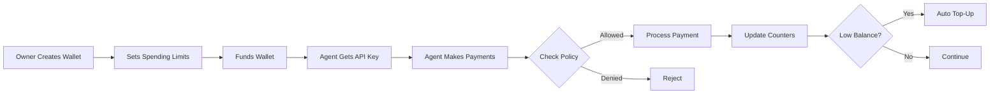

# Agent Wallet Overview

Agent Wallets are specialized wallets designed for AI agents, with built-in spending controls, service allowlists, and automatic top-up functionality.

## Why Agent Wallets?

AI agents need to make payments autonomously but require:
- **Budget Controls**: Daily, monthly, and per-transaction limits
- **Service Restrictions**: Allowlists/blocklists for approved services
- **Owner Oversight**: Human control and monitoring
- **Automatic Refills**: Top-up when balance runs low
- **Audit Trail**: Complete activity history

## Key Features

### 🔒 Spending Policies

```typescript
{
  dailyLimit: "10.00",         // Max $10/day
  perTransactionLimit: "1.00",  // Max $1 per payment
  monthlyLimit: "100.00",       // Max $100/month
  cooldownSeconds: 60           // Min 60s between payments
}
```

### ✅ Service Allowlists

```typescript
{
  mode: "allowlist",
  services: [
    "openai-*",      // All OpenAI services
    "anthropic-*",   // All Anthropic services
    "specific-api-id"
  ]
}
```

### 🔄 Auto Top-Up

```typescript
{
  enabled: true,
  threshold: "10.00",   // Top up when below $10
  amount: "50.00",      // Add $50
  source: "credits",    // From credit balance
  maxPerMonth: "200.00" // Safety cap
}
```

## How It Works



## Use Cases

### Research Agent
- Daily budget: $5
- Only approved data APIs
- Auto top-up from owner's credits

### Trading Bot
- High transaction limits
- Specific DEX protocols only
- No auto top-up (manual control)

### Content Generator
- Per-use payments for AI services
- Strict allowlist
- Low cooldown for rapid requests

## Quick Example

### Owner Side: Create Wallet

```typescript
import { WalletManager } from '@nirholas/agent-wallet';

const manager = new WalletManager();

const { wallet, apiKey } = await manager.createWallet({
  name: 'Research Agent',
  owner: 'user_123',
  network: 'base',
  initialBalance: '50.00',
  spendingPolicy: {
    dailyLimit: '10.00',
    perTransactionLimit: '1.00',
    monthlyLimit: '100.00',
  },
  allowlist: {
    mode: 'allowlist',
    services: ['approved-api-*'],
  },
  autoTopUp: {
    enabled: true,
    threshold: '10.00',
    amount: '50.00',
    source: 'credits',
    maxPerMonth: '200.00',
    currentMonthTopUps: '0.00',
  },
});

// Save these securely
console.log(`Wallet ID: ${wallet.id}`);
console.log(`API Key: ${apiKey}`);
```

### Agent Side: Use Wallet

```typescript
import { AgentWalletClient } from '@nirholas/agent-wallet';
import axios from 'axios';

const client = new AgentWalletClient({
  walletId: process.env.AGENT_WALLET_ID,
  apiKey: process.env.AGENT_WALLET_API_KEY,
  facilitatorUrl: 'https://facilitator.example.com',
});

// Check budget
const budget = await client.getBudget();
console.log(`Daily remaining: $${budget.dailyRemaining}`);

// Wrap HTTP client
const api = client.wrapAxios(axios.create({
  baseURL: 'https://api.example.com'
}));

// Automatic payment on 402
const data = await api.get('/paid-endpoint');
```

## MCP Integration

```json
{
  "mcpServers": {
    "research-agent": {
      "command": "npx",
      "args": ["@nirholas/research-mcp"],
      "env": {
        "AGENT_WALLET_ID": "wallet_abc123",
        "AGENT_WALLET_API_KEY": "ak_xyz789"
      }
    }
  }
}
```

## Security Best Practices

1. **Keep API Keys Secure**: Never commit to version control
2. **Set Conservative Limits**: Start with low daily limits
3. **Use Allowlists**: Restrict to known services
4. **Monitor Activity**: Check wallet activity regularly
5. **Enable Alerts**: Get notified of unusual spending

## Revenue Model

- **Wallet Fee**: $1.50/month per active wallet
- **Top-Up Fee**: 1% on auto top-ups
- **No Creation Fee**: Free to create wallets

## Next Steps

- [Creating Wallets](./creating-wallets)
- [Spending Policies](./spending-policies)
- [MCP Integration](./mcp-integration)
- [API Reference](../api/wallets)
