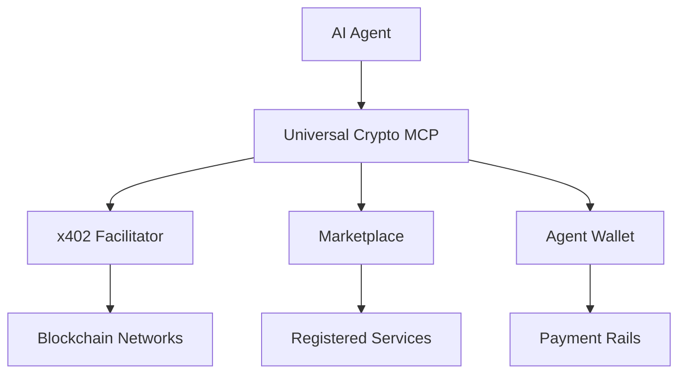

# Introduction

Welcome to **Universal Crypto MCP** - the largest Model Context Protocol (MCP) server for cryptocurrency tools, providing 150+ tools for DeFi, NFTs, payments, and more.

## What is Universal Crypto MCP?

Universal Crypto MCP is a comprehensive toolkit that enables AI agents (like Claude, GPT, and others) to interact with blockchain networks, manage crypto payments, and access decentralized services - all through a standardized protocol.

### Key Features

🔧 **150+ Crypto Tools**
- DeFi protocols (Uniswap, Aave, Compound)
- NFT marketplaces (OpenSea, Blur)
- Price feeds and analytics
- Wallet management
- Token transfers and swaps

💳 **x402 Payment Rails**
- HTTP 402 Payment Required integration
- Multi-chain support (Ethereum, Base, Arbitrum, Solana)
- Automatic payment handling
- Credit system for fiat payments

🏪 **Service Marketplace**
- Discover and register AI services
- Subscription management
- Reputation system
- Featured listings

🤖 **Agent Wallets**
- Pre-funded wallets for AI agents
- Spending limits and controls
- Service allowlists
- Auto top-up functionality

## Quick Start

Get started with Universal Crypto MCP in under 5 minutes:

```bash
# Install via npm
npm install @nirholas/universal-crypto-mcp

# Or use in Claude Desktop
npx @nirholas/universal-crypto-mcp
```

See the [Quick Start Guide](./getting-started/quick-start) for detailed instructions.

## Use Cases

### For AI Agents
Enable your AI agent to:
- Make crypto payments autonomously
- Trade tokens and manage portfolios
- Access premium APIs with automatic payment
- Interact with DeFi protocols

### For API Providers
Monetize your API with:
- Pay-per-use pricing
- Subscription models
- Cryptocurrency payments
- Fiat credit purchases

### For Developers
Build applications with:
- Ready-to-use crypto tools
- Payment infrastructure
- Service discovery
- Agent wallet management

## Architecture



## Next Steps

- 📖 Read the [Getting Started Guide](./getting-started/installation)
- 🚀 Follow a [Tutorial](./tutorials/build-paid-api)
- 🔍 Browse the [API Reference](./api/facilitator)
- 💬 Join our [Discord Community](https://discord.gg/universal-crypto-mcp)

## Community & Support

- **GitHub**: [nirholas/universal-crypto-mcp](https://github.com/nirholas/universal-crypto-mcp)
- **Discord**: [Join our community](https://discord.gg/universal-crypto-mcp)
- **Twitter**: [@universal_mcp](https://twitter.com/universal_mcp)
- **Discussions**: [GitHub Discussions](https://github.com/nirholas/universal-crypto-mcp/discussions)

## License

Universal Crypto MCP is licensed under the [Apache 2.0 License](https://github.com/nirholas/universal-crypto-mcp/blob/main/LICENSE).
